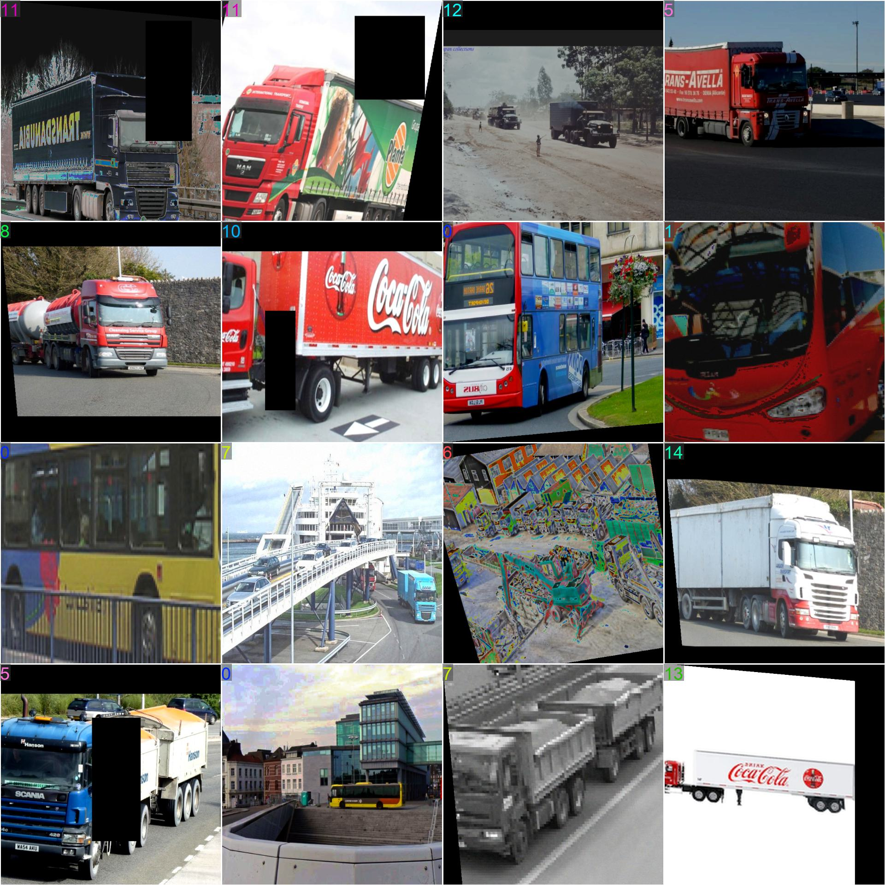
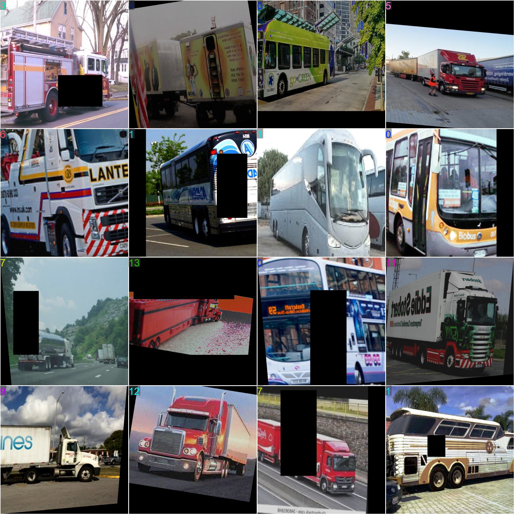
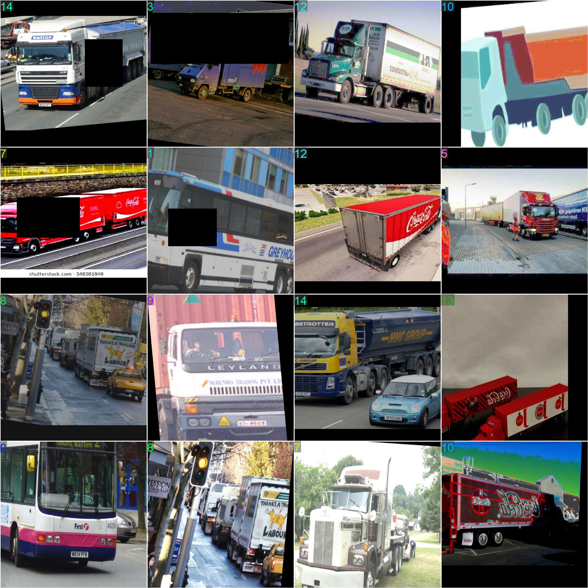
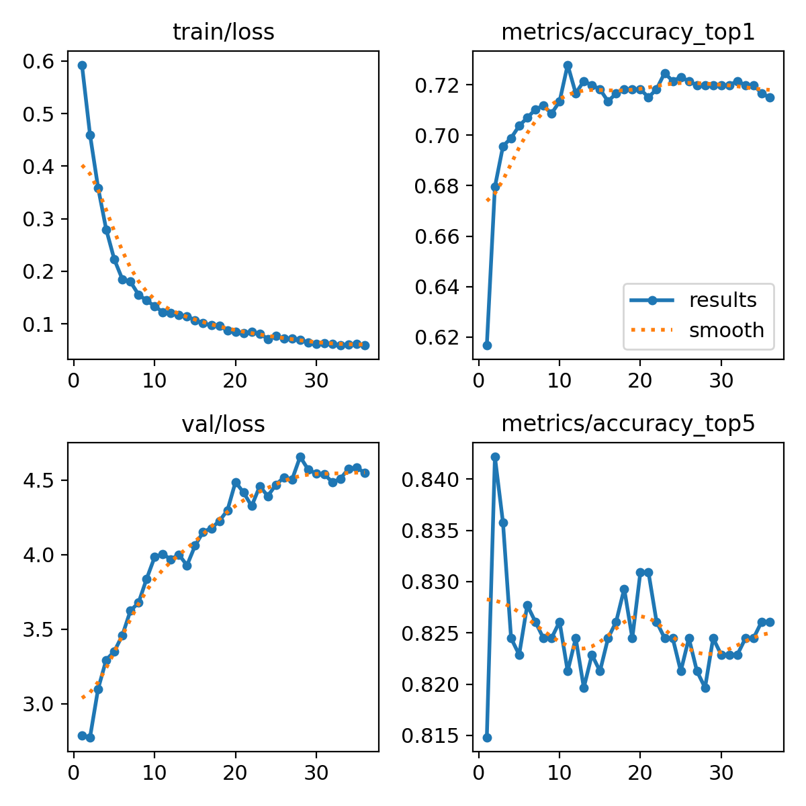
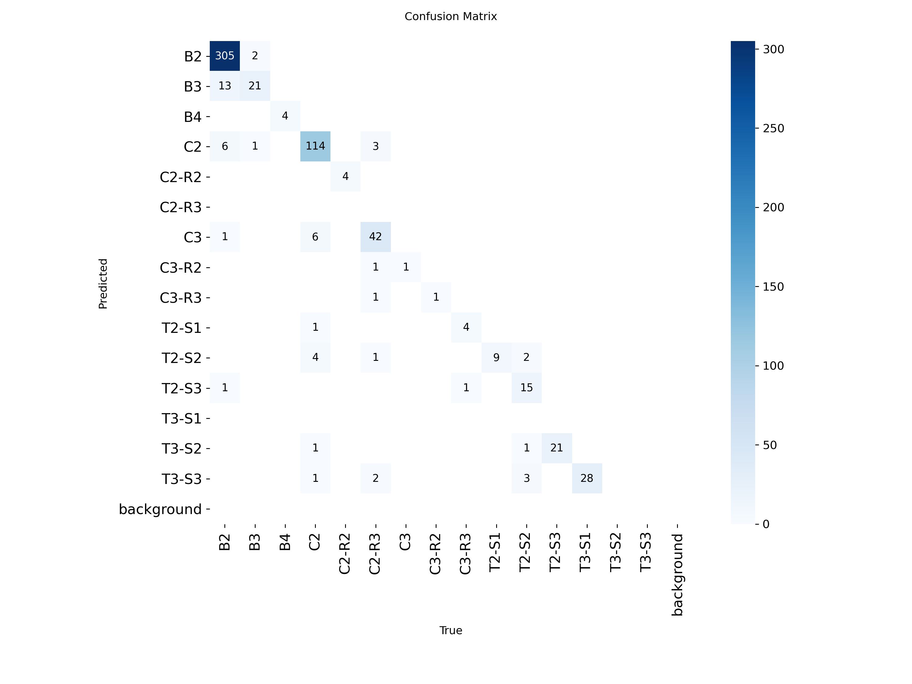
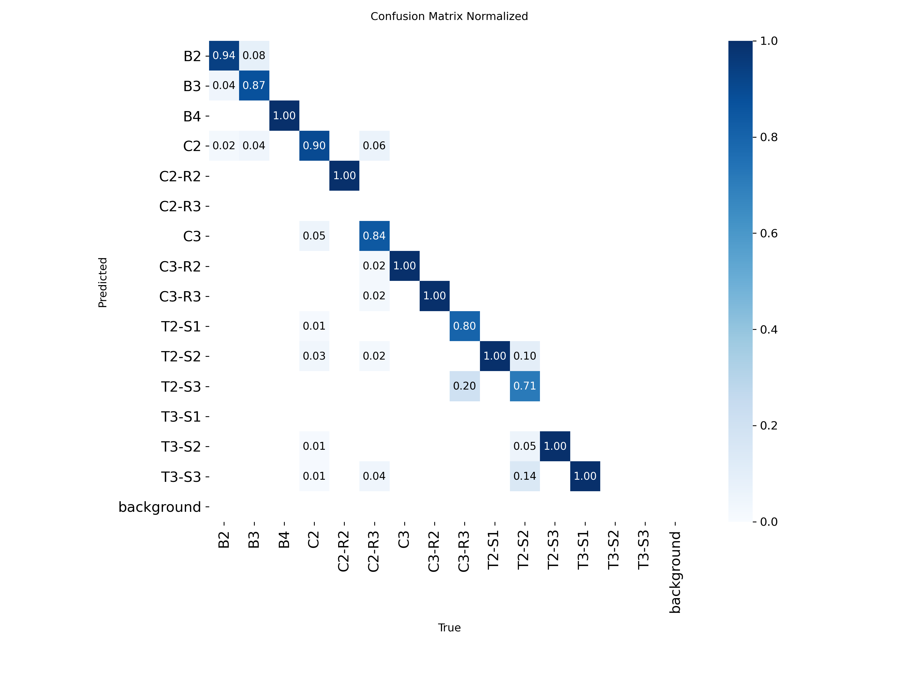

# 🚗 Vehicle_MEX_Model — Fine-Grained Vehicle Classification (YOLO-CLS)

<div align="center">
  
  
  
</div>

<div align="center">

[](https://github.com/ultralytics/ultralytics)
[](#-overview)
[](#-technical-specs)
[](#-hyperparameter-tuning-hpo)

</div>

## 📌 Overview
Este repositorio documenta el entrenamiento de un **modelo baseline** para **clasificación de vehículos** (fine-grained) usando **Ultralytics YOLO (modo classify)** sobre el dataset `Vehicle_MEX_Dataset`.  
Incluye scripts reproducibles, notebooks de aumento de datos, métricas, y visualizaciones (sin subir el dataset completo de imágenes).

## 📦 Dataset
- **Dataset original (descarga):** https://data.mendeley.com/datasets/gbk6gnv245/1
- **Estructura esperada para YOLO-CLS:**

```text
Vehicle_classification.v1/
├── train/
│   ├── B2/
│   ├── B3/
│   └── ...
├── valid/
│   ├── B2/
│   ├── B3/
│   └── ...
└── test/
    ├── B2/
    ├── B3/
    └── ...
```

## 🎯 Objectives
- ✅ Entrenar un **baseline reproducible** para clasificación de vehículos.
- ✅ Identificar errores por clase usando **matriz de confusión**.
- ✅ Proponer y ejecutar mejoras con **regularización** y **aumento de datos**.
- ✅ Preparar un flujo opcional de **búsqueda de hiperparámetros (HPO)** para acelerar la convergencia y mejorar precisión.

## 🧠 Method (Training Pipeline)
**Etapas del flujo:**
1. **Preprocesamiento y balanceo** con `notebooks/Data_augmenter.ipynb`
2. Entrenamiento con **YOLO-CLS** (Ultralytics)
3. Validación y análisis (matrices de confusión + curvas de entrenamiento)
4. Ajustes manuales e iteración
5. (Opcional) **HPO con Ray Tune + Optuna** para encontrar mejores hiperparámetros

## 📈 Results (Baseline_model-3)
Resultados reportados en `results/Terminal.txt` y visualizados en `results/`.

- **Top-1 Accuracy:** 0.7246
- **Top-5 Accuracy:** 0.8245
- **Best epoch (early stopping):** 11

<div align="center">
  
</div>

### 🔎 Confusion Matrix
<div align="center">
  
  
</div>

## 🎞️ Demo (Training Batches)
<div align="center">
  
</div>

## 🧩 Project Structure
```text
Vehicle_MEX_Model/
├── assets/                      # Imágenes/GIF ligeros para README (no dataset completo)
├── configs/                     # Configuraciones usadas en entrenamientos
├── notebooks/                   # Notebooks de análisis/augmentación
├── results/                     # Curvas, matrices, logs, CSV de resultados
├── scripts/                     # Scripts de entrenamiento y HPO
├── requirements.txt
├── .gitignore
└── README.md
```

## 🛠️ Installation
### 1) Clonar
```bash
git clone <TU_URL_DE_GITHUB>/Vehicle_MEX_Model.git
cd Vehicle_MEX_Model
```

### 2) Crear entorno (recomendado)
```bash
python -m venv .venv
```

**Windows**
```bash
.venv\Scripts\activate
```

**Linux/Mac**
```bash
source .venv/bin/activate
```

### 3) Instalar dependencias
```bash
pip install -r requirements.txt
```

## 🚀 Training
Script principal:
- `scripts/1_Classification.py`

Ejemplo:
```bash
python scripts/1_Classification.py
```

## 🧪 Dataset Augmentation & Balancing
Notebook:
- `notebooks/Data_augmenter.ipynb`

Incluye:
- selector de carpetas (local)
- análisis automático de desbalance por clase
- previsualización de augmentations
- export a estructura YOLO-CLS con imágenes 640x640 (padding + Lanczos)

## 🧬 Hyperparameter Tuning (HPO)
Script:
- `scripts/1_Classification_Optuna.py`

Este flujo usa `model.tune(..., use_ray=True)` (Ray Tune) y permite búsqueda tipo Optuna.  
Requiere instalar dependencias adicionales:
```bash
pip install -U "ray[tune]" optuna
```

## ✨ Main Features
- 🧱 Reproducibilidad: logs + configs (`configs/`, `results/`)
- 🧰 Aumentos realistas orientados a vehículos (rotación leve, perspectiva, brillo/contraste, ruido)
- 🧯 Regularización agresiva (dropout, weight decay, warmup)
- 🧪 HPO opcional con Ray Tune + Optuna

## 🧾 Technical Specs
- **Framework:** Ultralytics YOLO (classification)
- **Input:** 640×640 (con padding para conservar proporciones)
- **Optimizer:** AdamW
- **Scheduler:** Cosine LR (si se habilita en los scripts)

## 🏙️ Applications
- 🚦 Clasificación automática de tipos de vehículos en escenarios urbanos y carreteros
- 🛣️ Analítica de tráfico por categoría
- 🧾 Inventario vehicular y monitoreo en infraestructura
- 🔍 Soporte a sistemas ITS (Intelligent Transportation Systems)

## 🧑‍🔬 Research Team
Formato inspirado en: https://github.com/JaGuzmanT/SaltSpot

<table align="center">
  <thead>
    <tr>
      <th align="center" width="120">Photo</th>
      <th align="left">Researcher</th>
      <th align="left">Affiliation</th>
      <th align="left">Contact</th>
    </tr>
  </thead>
  <tbody>
    <tr>
      <td align="center" width="120">
        
      </td>
      <td>
        <b>Dr. José Alberto Guzmán Torres</b> :mexico:
        <sub>Engineering Applications &amp; Artificial Intelligence</sub>
      </td>
      <td>
        <a href="http://www.siiia.com.mx"></a>
        <a href="http://www.umich.mx"></a>
      </td>
      <td>
        <a href="mailto:jose.alberto.guzman@umich.mx"></a>
        <a href="https://orcid.org/0000-0002-9309-9390"></a>
        <a href="https://www.researchgate.net/profile/Jose-Guzman-Torres"></a>
      </td>
    </tr>
    <tr>
      <td align="center" width="120">
        
      </td>
      <td>
        <b>Dr. Francisco Javier Domínguez Mota</b> :mexico:
        <sub>Applied Mathematics &amp; Finite Difference Methods</sub>
      </td>
      <td>
        <a href="http://www.siiia.com.mx"></a>
        <a href="http://www.umich.mx"></a>
      </td>
      <td>
        <a href="mailto:francisco.mota@umich.mx"></a>
        <a href="https://orcid.org/0000-0001-6837-172X"></a>
        <a href="https://www.researchgate.net/profile/Francisco-Dominguez-Mota"></a>
      </td>
    </tr>
    <tr>
      <td align="center" width="120">
        
      </td>
      <td>
        <b>Dra. Elia M. Alonso Guzmán</b> :mexico:
        <sub>Civil Engineering &amp; Materials Science</sub>
      </td>
      <td>
        <a href="http://www.umich.mx"></a>
      </td>
      <td>
        <a href="mailto:elia.alonso@umich.mx"></a>
        <a href="https://orcid.org/0000-0002-8502-4313"></a>
        <a href="#"></a>
      </td>
    </tr>
    <tr>
      <td align="center" width="120">
        
      </td>
      <td>
        <b>Dr. Gerardo Tinoco Guerrero</b> :mexico:
        <sub>Numerical Methods &amp; Computational Mathematics</sub>
      </td>
      <td>
        <a href="http://www.siiia.com.mx"></a>
        <a href="http://www.umich.mx"></a>
      </td>
      <td>
        <a href="mailto:gerardo.tinoco@umich.mx"></a>
        <a href="https://orcid.org/0000-0003-3119-770X"></a>
        <a href="https://www.researchgate.net/profile/Gerardo-Tinoco-Guerrero"></a>
      </td>
    </tr>
    <tr>
      <td align="center" width="120">
        
      </td>
      <td>
        <b>Dr. José Gerardo Tinoco Ruíz</b> :mexico:
        <sub>Applied Mathematics &amp; Computational Modeling</sub>
      </td>
      <td>
        <a href="http://www.umich.mx"></a>
      </td>
      <td>
        <a href="mailto:jose.gerardo.tinoco@umich.mx"></a>
        <a href="https://orcid.org/0000-0002-0866-4798"></a>
        <a href="#"></a>
      </td>
    </tr>
    <tr>
      <td align="center" width="120">
        
      </td>
      <td>
        <b>Dr. Heriberto Árias Rojas</b> :mexico:
        <sub>Engineering Applications</sub>
      </td>
      <td>
        <a href="http://www.siiia.com.mx"></a>
        <a href="http://www.umich.mx"></a>
      </td>
      <td>
        <a href="mailto:heriberto.arias@umich.mx"></a>
        <a href="https://orcid.org/0000-0002-7641-8310"></a>
        <a href="https://www.researchgate.net/profile/Heriberto-Arias-Rojas"></a>
      </td>
    </tr>
  </tbody>
</table>

## ⚖️ License
MIT License. See [LICENSE](LICENSE).

